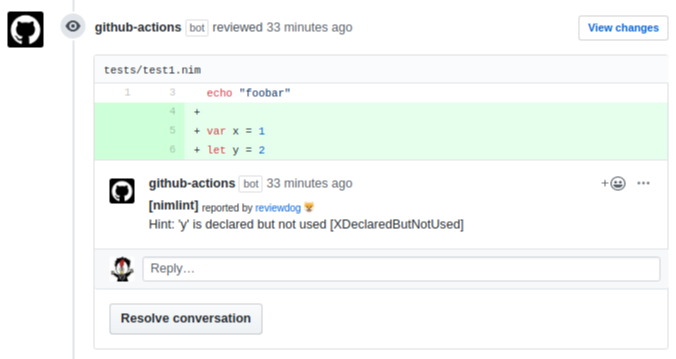

# nimlint-action

**INFO:** This repository moved to [reviewdog/action-nimlint](https://github.com/reviewdog/action-nimlint).
I will continue to maintenance that, and i will not maintenance this repository.
Please you use that too.

---

This action lints Nim codes.
nimlint-action is inspired by [reviewdog/action-eslint](https://github.com/reviewdog/action-eslint).

This action runs `nim check` with
[reviewdog](https://github.com/reviewdog/reviewdog) on pull requests to improve
code review experience.

[](https://github.com/jiro4989/nimlint-action/pull/5)

## Inputs

### `github_token`

**Required**. Must be in form of `github_token: ${{ secrets.github_token }}`'.

### `level`

Optional. Report level for reviewdog [info,warning,error].
It's same as `-level` flag of reviewdog.

### `reporter`

Reporter of reviewdog command [github-pr-check,github-check,github-pr-review].
Default is github-pr-check.
It's same as `-reporter` flag of reviewdog.

github-pr-review can use Markdown and add a link to rule page in reviewdog reports.

### `src`

Optional. Nim source code path glob. Default: 'src/*.nim'

### `ignore_regexp`

Optional. Ignore message pattern. Default: ''

## Example usage

You also need to install [nim](https://github.com/nim-lang/Nim).  

### [.github/workflows/nimlint-action.yml](.github/workflows/nimlint-action.yml)

```yml
name: nimlint

on: [pull_request]

jobs:
  nimlint:
    name: runner / nimlint
    runs-on: ubuntu-latest
    steps:
      - uses: actions/checkout@v2

      - name: nimlint-github-pr-review
        uses: jiro4989/nimlint-action@v1.0.0
        with:
          github_token: ${{ secrets.github_token }}
          reporter: github-pr-review # Change reporter.
          src: 'src/*.nim'
```

## License

MIT
